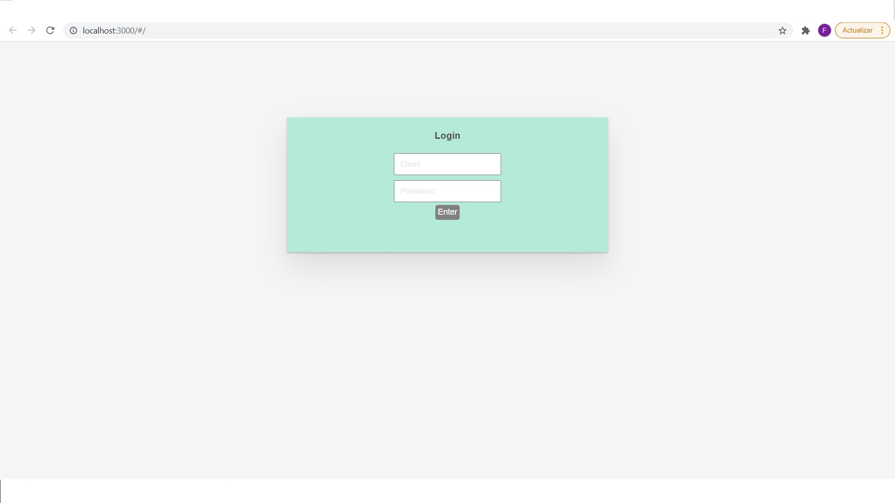
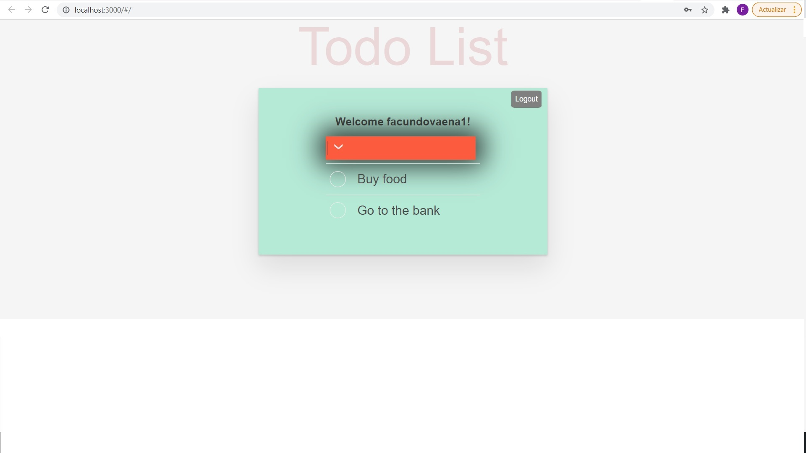

# Tasks List

### Tecnologías:
 - 8base
 - Graphql
 - React
 - Cypress

### Configuración de inicio:
1. Clonar proyecto

2. Abrir proyecto en editor

3. npm install

4. cd client/ ---> npm install

5. cd . .

6. cd server/ ---> npm install 

### Correr proyecto:
1. cd client/
2. npm start

### Correr tests:
1. cd client/
2. npx cypress open
